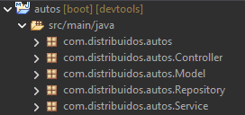
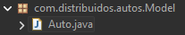
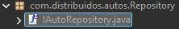
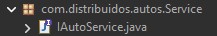
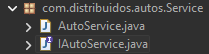
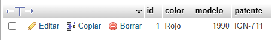
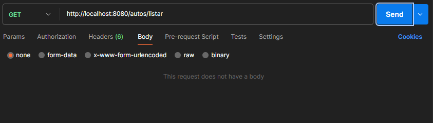
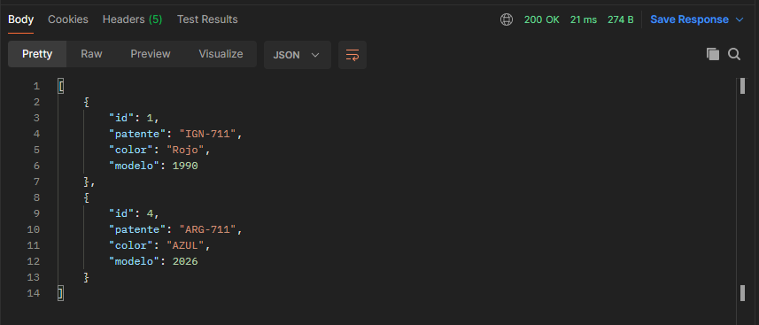

# Proyecto Microservicio

## Alumno: Figueroa Romero Jose Ignacio

## GUIA:

### 1.Configuracion
En el sitio web start.spring.io configurar el proyecto, agregando las dependencia correspondientes, el lenguaje, tipo de proyecto, version de Sprign Boot, y la version de java.
Al terminar la configuracion, generar el archivo ZIP


### 2.Importación y Apertura en Spring Boot
Primero hay que descombrimir el archivo y luego importar en la aplicacion de Spring Boot.


### 3.Creación de la Estructura de Paquetes
Con la finalidad de respetar estrictamente la arquitectura en capas, es necesario crear 4 paquetes dentro de la ruta principal com.distribuidos.autos.


### 4.Creación de la Entidad Auto.java
Vamos a empezar con el modelado de Auto, la clase Auto.java debe estar en el paquete Model. Dentro del modelo de paquete, se procederá a definir la clase de dominio que representará la tabla dentro de la base de datos. En este caso dado que se trata del primer microservicio que estamos haciendo utilizaremos únicamente tipos de datos elementales para facilitar la comprensión.

Seleccione Nuevo > Clase Java e ingrese el nombre Auto .



``` java
package com.distribuidos.autos.Model;

import jakarta.persistence.Entity;
import jakarta.persistence.GeneratedValue;
import jakarta.persistence.GenerationType;
import jakarta.persistence.Id;
import lombok.Getter;
import lombok.Setter;

@Entity
@Getter @Setter
public class Auto {
	
	@Id
	@GeneratedValue(strategy=GenerationType.IDENTITY)
	private Long id;
	
	private String patente;
	private String color;
	private int modelo;

	public Auto() {
		super();
	}
	
	public Auto(Long id, String patente, String color, int modelo) {
		super();
		this.id = id;
		this.patente = patente;
		this.color = color;
		this.modelo = modelo;
	}
	public Long getId() {
		return id;
	}
	public String getPatente() {
		return patente;
	}
	public String getColor() {
		return color;
	}
	public int getModelo() {
		return modelo;
	}
}

```

### 5. Creación de Interfaz de Repositorio
Esta clase es escencial ya que la calse hereda los metodos de Jpa para poder utilizarlos.


```java
package com.distribuidos.autos.Repository;

import org.springframework.data.jpa.repository.JpaRepository;
import org.springframework.stereotype.Repository;

import com.distribuidos.autos.Model.Auto;

@Repository
public interface IAutoRepository extends JpaRepository<Auto, Long>{

}
```

### 6. Creación de Interfaz de Servicio
En esta interfaz, creamos las firmas de los metodos.

```java
package com.distribuidos.autos.Service;

import java.util.List;
import com.distribuidos.autos.Model.Auto;

public interface IAutoService {

	public void crearAuto(Auto auto);
	public List<Auto> listarAutos();
}
```

### 7. Implementación de Interfaz de Servicio
En el mismo paquete creamos una clase que va a imlementar los metodos de la interfaz. 


```java
package com.distribuidos.autos.Service;

import java.util.List;
import org.springframework.beans.factory.annotation.Autowired;
import org.springframework.stereotype.Service;
import com.distribuidos.autos.Model.Auto;
import com.distribuidos.autos.Repository.IAutoRepository;

@Service
public class AutoService implements IAutoService{
	
	@Autowired
	private IAutoRepository repoAuto;
	
	@Override
	public void crearAuto(Auto auto) {
		repoAuto.save(auto);
		
	}

	@Override
	public List<Auto> listarAutos() {
		return repoAuto.findAll();
	}

}

```

### 8. Creación de Controlador (puntos finales)
En esta clase se crear los metodos POST y GET que son petisiones .
Se realiaza un inyeccion de depedencia de la implementacion para poder llamar a los metodos con su logica.



```java
package com.distribuidos.autos.Controller;

import java.util.List;

import org.springframework.beans.factory.annotation.Autowired;
import org.springframework.web.bind.annotation.GetMapping;
import org.springframework.web.bind.annotation.PostMapping;
import org.springframework.web.bind.annotation.RequestBody;
import org.springframework.web.bind.annotation.RestController;
import com.distribuidos.autos.Model.Auto;
import com.distribuidos.autos.Service.AutoService;

@RestController
public class AutoController {
	
	@Autowired
	private AutoService autoServicio;
	
	@PostMapping ("/auto/crear") 
	public String crearAuto (@RequestBody Auto auto){
		autoServicio.crearAuto(auto);
		return "Auto Creado";
	}
	
	
	@GetMapping ("/autos/listar")
	public List<Auto> listarAutos(){
		return autoServicio.listarAutos();
	}
	
}
```

### 9. Configuración de propiedades y XAMMP
En xampp creamos la base de datos


Nos dirigimos a Spring Boot y en application.properties configueramos el puerto y la coneccion con la base de datos.


```java
spring.application.name=autos
server.port = 8080
spring.jpa.hibernate.ddl-auto=update
spring.datasource.url=jdbc:mysql://localhost:3306/servicio_autos?serverTimezone=UTC
spring.datasource.username=root
spring.datasource.password=
```

# GUIA DE APLICACION CON POSTAMAN:

### 1. Iniciar el proyecto.


### 2.Ingresar la URL con su petición correspondiente.

En la aplicacion de Postman, escribir el puerto de la cofiguracion del application.properties http://localhost:8080 y agregarle la direccion que se encuentra en el Controller en el metodo POST /auto/crear.
Entonces quedaria asi http://localhost:8080/auto/crear, seleccionar el metodo correspondiente (POST).
 
 

### 3. Formato JSON.
En el apartado de Body utilizar el formato JSON para crear un nuevo objeto (auto) con sus atrubutos correspondientes.
Ademas debe estar seleccionado raw y el formato JSON.
Y por ultimo precionar el boton Send


### 4.Verificar que se creo el objeto.
En xampp nos dirigimos a la base de daros y verificamos que este la tabla con el objeto creado.


### 4.Llamar a la lista de Autos.

Se repite el paso 2 y 3 pero con un cambio en cada uno.

Se escribe el mismo puerto pero se cambian el la direccion del Controller y se pone /autos/l istar,  tambien hay que colocar el metodo GET.


 En el Body hay que seleccionar la casilla none.



Al precionar el boton Send por medio de la direccion, ingresa al metodo de listar los autos creados y los muestra en formato JSON.

